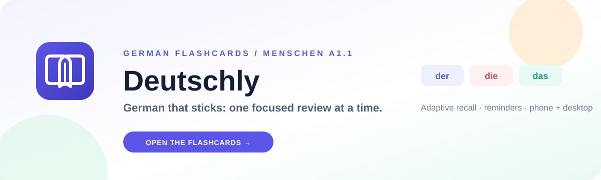

<div align="center">
  
  <h1>DEUTSCHLY</h1>
  <p><strong>German that sticks — one focused review at a time.</strong></p>
  <p>
    <a href="https://soheil-aghayani.github.io/Deutschly/"><strong>Open the live app →</strong></a>
  </p>
  <p>
    
    
    
  </p>
</div>

Deutschly is a calm, adaptive German flashcard workspace built around a **Menschen A1.1** learning journey. It runs in a desktop browser, on a phone, or as an installed app, while keeping the learner's cards local by default.

## The learning loop

| Step | What happens | Why it matters |
| :--- | :--- | :--- |
| **01 · Recall** | See the German word before the answer. | Retrieval builds stronger memory than rereading. |
| **02 · Reveal** | Check the meaning, example, pronunciation, and grammar details. | Each card gives the word a useful context. |
| **03 · Rate** | Choose **Again**, **Hard**, **Good**, or **Easy**. | Adaptive scheduling brings the right card back at the right time. |

## What makes Deutschly useful

| Workspace | Experience |
| :--- | :--- |
| **Study now** | Adaptive reviews with keyboard controls, pronunciation, examples, and XP feedback. |
| **Practice Lab** | Short drills for articles, plurals, translations, sentence gaps, and mixed recall. |
| **My library** | Personal vocabulary, phrases, grammar cards, tags, weak-card filters, search, and bulk actions. |
| **Word bank** | Checked A1/A2 vocabulary with meanings, articles, plurals, examples, source context, and learner tags. |
| **PDF import** | Read selectable text from a local Menschen PDF and keep suggestions linked to their page and context. |
| **Progress** | Streaks, review activity, XP levels, achievements, recall accuracy, and daily goals. |
| **Phone + desktop** | Installable PWA, local persistence, reminders, light/dark themes, and private-room sync on trusted Wi-Fi. |

## A few thoughtful details

- German articles stay visually consistent: `der` blue, `die` red, `das` green, and plural orange.
- The card checker normalizes entries such as `Das Eis`, blocks exact duplicates, and flags possible duplicates before saving.
- AI suggestions are optional. The local checker and word database remain the source of truth; suggestions are never saved automatically.
- A synchronous per-card review guard prevents a rapid click + `Space` from reviewing the same card twice.
- Export a backup before moving to a new browser. Local data stays in the browser unless you explicitly use account sync or the private-room flow.

## Run locally

```bash
git clone https://github.com/Soheil-Aghayani/Deutschly.git
cd Deutschly
npm install
npm run dev
```

Open the local URL printed by Vite. Before opening a pull request or publishing a change, run:

```bash
npm run typecheck
npm test -- --run
npm run test:worker
npm run build
```

## Project map

```text
Deutschly/
├─ src/                    # React application and UI styles
│  ├─ data/                # Lessons, generated word bank, and content metadata
│  └─ lib/                 # Learning, sync, PDF, AI, and persistence helpers
├─ public/                 # PWA shell, icons, achievement art, and README hero
├─ cloudflare/             # Optional public AI bridge and worker tests
├─ scripts/                # Bounded word-bank and Menschen PDF agents
├─ server.mjs              # Private LAN sync and local AI bridge
└─ .github/workflows/      # GitHub Pages deployment
```

<details>
<summary><strong>Sync a phone and computer over private Wi-Fi</strong></summary>

From the project folder, run both commands on the computer:

```bash
npm run sync-server -- --host 0.0.0.0
npm run dev:network
```

Open the network URL printed by Vite on both devices. In Deutschly, open **Set up sync**, use `http://<PC-LAN-IP>:8787/api/sync` as the server URL, and enter the same room code on both devices. Keep both devices on the same trusted Wi-Fi network.

The room data is stored in the ignored `.deutschly/sync.json` file on the computer. The static GitHub Pages site does not host this private server.

On Windows Command Prompt, if the prompt starts at `C:\Users\Soheil>`:

```bat
cd /d "C:\Users\Soheil\Documents\ChatGPT\Gamify"
```

</details>

<details>
<summary><strong>Optional Firebase account sync</strong></summary>

Deutschly can use Firebase Authentication and Firestore for account-based sync. Without Firebase settings, the app remains fully local and private-room sync is still available.

1. Create a Firebase project and add a Web app.
2. Enable Google under Authentication providers.
3. Create a Firestore database and publish `firestore.rules`.
4. Copy `.env.example` to `.env.local` and fill in the six `VITE_FIREBASE_*` values.
5. Add the same values to the GitHub repository or environment variables for Pages builds.
6. Add the deployed Pages domain and `localhost` to Firebase's authorized domains.

The Firebase Hosting build is also available at <https://deutschly-app-2026.web.app/>. Keep OAuth client secrets in provider settings; never add them to this repository.

</details>

<details>
<summary><strong>Optional AI card review and word generation</strong></summary>

The local bridge supports either Gemini or Ollama. Keep the Gemini key on the computer that runs the bridge:

```powershell
$env:GEMINI_API_FILE = 'C:\path\to\Gemini API.txt'
npm run sync-server -- --host 0.0.0.0
```

For a local Ollama provider:

```powershell
$env:AI_PROVIDER = 'ollama'
$env:OLLAMA_MODEL = 'qwen3:4b'
ollama pull qwen3:4b
npm run sync-server -- --host 0.0.0.0
```

The bounded word agent can add reviewed A1/A2 records to the local database:

```powershell
npm run words:agent -- --server-url 'http://127.0.0.1:8787' --levels A1,A2 --count 20 --batches 1
```

For the exact Cloudflare Worker deployment flow and tests, see [`cloudflare/README.md`](cloudflare/README.md). The public bridge uses an allowlist and remains subject to the provider's daily limits.

</details>

<details>
<summary><strong>Import vocabulary from a Menschen PDF</strong></summary>

The source-aware importer verifies selected words on their declared PDF pages and skips entries that cannot be found or already exist:

```powershell
npm run menschen:agent -- --pdf 'C:\path\to\Menschen A1.1 Kursbuch OCR neu.pdf' --server-url 'http://127.0.0.1:8787' --limit 16
```

The source PDF is never committed to the repository.

</details>

## Deployment

`.github/workflows/deploy.yml` builds `dist` and publishes GitHub Pages whenever `main` changes. The repository uses **GitHub Actions** as its Pages source.

Live app: <https://soheil-aghayani.github.io/Deutschly/>

<div align="center">
  <sub>Built for small steps, clear progress, and German that stays with you.</sub>
</div>
